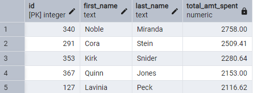
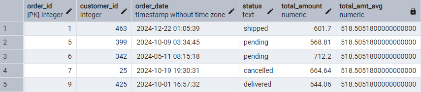
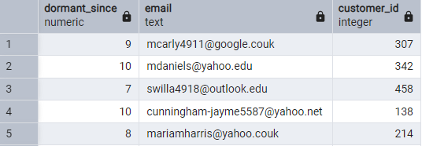
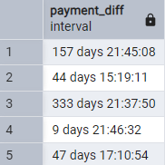
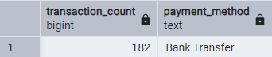

# E-commerce database with various queries

## Mock data set used:

<ul>
<li>Used Mockaroo and generatedata to create mock dataset</li>
<li>The dataset consists of 5 tables, each populated with 500 rows</li>
</ul>

## Database used:

Postgres

## Tasks completed:

<ol>
<li>

Find the Most Valuable Customers

</li>
<li>

Detect High-Value Orders (un-sorted)

</li>
<li>

Identify Inactive Customers

</li>
<li>

Detect Late Payments

</li>
<li>

Find the Most Popular Payment Method

</li>
</ol>
